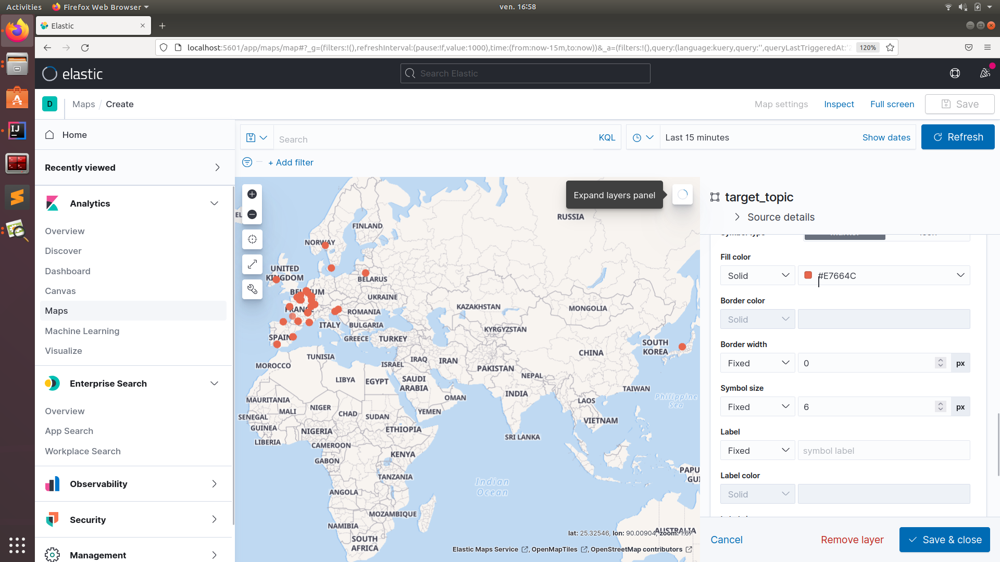

# kafka-elastic-spark
# Central dashboard application

## discription :

the project consists in visualizing the number of bikes available from the vilib api, for this you must have a key to have access to the on API:  https://developer.jcdecaux.com/#/home.

## needed tools:
1. Docker (and docker-compose)
2. scala
## how to use :
1. install services locally (zookeeper, kafka brocker, kafka-connect, schema-registry, elasticsearch, kibana):
  docker-compose up -d
2. if you want to see fastly the changes in kibana lanch the script main_producer_simulated_data,
3. if you want to see the real changes data in kibana lanch the script main_producer_real
## results:
the index is now saved on elasticsearch with real-time update.
interacting with the index with kibana and making the desired graphics in real time,
example of graph: above two screenshots of vilib stations on a map, between two instants